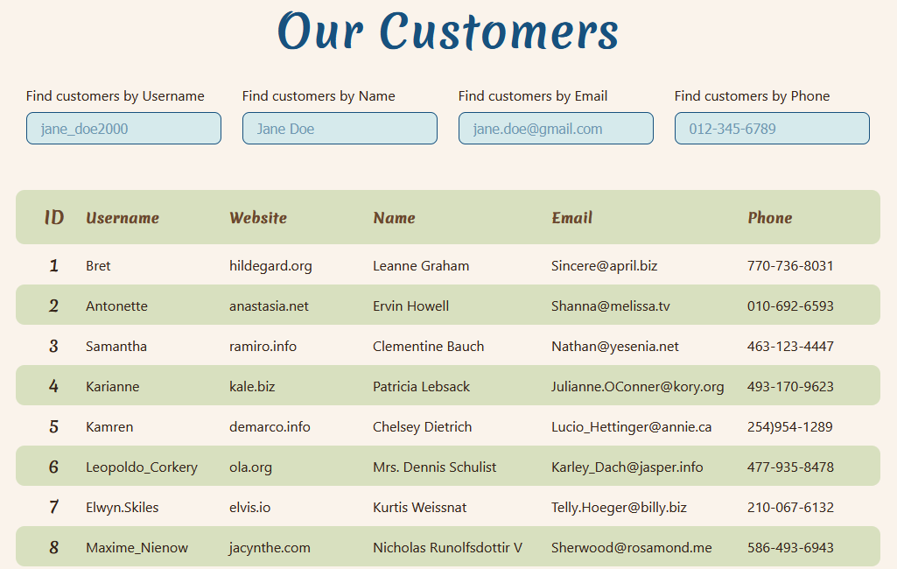

<section>
    <h1>Customer Showcase - Smart IT Test Task</h1>
    <h2>by Nadiia Yanushevska</h2>
    <a href="https://smart-it-test-task.vercel.app/">Live Link</a>
</section>

<section>
    <h3>Table of Contents</h3>
    <ul>
        <li><a href="#about">About Customer Showcase</a></li>
        <li><a href="#technologies">Tech Stack</a></li>
        <li><a href="#task">Task Description</a></li>
        <li><a href="#setup">Quick Setup</a></li>
    </ul>
</section>

<section id="about">
    <h3>About Customer Showcase</h3>
    

        Welcome to our Customer Showcase! Here, you can explore and browse through a diverse list of our valued clients.
    

        
    

        Discover the customers table, featuring a beautifully designed and intuitive user-friendly interface for effortless data management.
    

    

        Quickly search the table contents by name, username, email, and phone, making it easy to find the information you need quickly and efficiently.
    

</section>

<section id="technologies">
    <h3>Tech Stack</h3>
    <ul>
        <li>React</li>
        <li>Redux</li>
        <li>TypeScript</li>
        <li>REST API</li>
    </ul>
</section>

<section id="task">
    <h3>Task Description</h3>
    <dl>
        <dt>Brief Task Description</dt>
        <dd>Building a user management table that displays user information fetched from a mock API, along with implementing local filter functionality.</dd>
        <dt>Goal</dt>
        <dd>Showcase skills in creating a React application using Redux Toolkit and TypeScript.</dd>
    </dl>
</section>

<section id="setup">
    <h3>Quick Setup</h3>
    
&#9888; Requires Node.js LTS version

    <ol>
        <li>Clone repository</li>
        <li>Run <code>npm i</code></li>
        <li>Run <code>npm run dev</code></li>
        <li>The project will be live at <a href="http://localhost:5173">http://localhost:5173</a></li>
    </ol>
</section>
